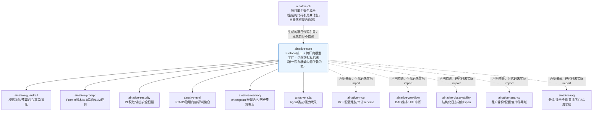

# AI Native Framework

Production-grade, independently pluggable Python packages extracted and
generalized from verified patterns in real production AI agent systems
(plus a few modules designed from scratch where no real-project precedent
existed — see Status below). This is the **Framework** layer of a three-layer
AI Native system:

1. **AI Native Methodology** — standards, maturity model, best practices (external).
2. **AI Native Framework** — this repository: reusable components.
3. **AI Native CLI** — `ainative new <project> --type <type>` one-command scaffolding — `ainative-cli` in this repository.

## Packages

| Package | Purpose |
|---|---|
| `ainative-core` | Foundation: `Protocol` interfaces, vendor-agnostic model factory with cross-vendor fallback, in-memory default backends. |
| `ainative-guardrail` | Agent runtime guardrails: model routing, token/call budgets, consecutive-failure/stall detection, composite health monitoring, idempotency-key management, queue-backlog early warning, and rate-limited downstream consumption. |
| `ainative-prompt` | Prompt version management, deterministic sticky A/B routing, LLM-as-judge evaluation. |
| `ainative-security` | PII redaction, output safety scanning (secrets/injection/malicious code), homoglyph folding, secret drift monitoring. |
| `ainative-eval` | FCARS-style governance gate (GREEN/YELLOW/RED/UNKNOWN/SKIPPED/NEEDS_REVIEW state machine with boundary-recheck noise reduction), judge-score aggregation. |
| `ainative-memory` | Checkpoint-saver factory (permanent vs. transient failure classification), long-term `MemoryStore` with owner-scoped deletion, PII-redacting persistence proxy, history token-budget trimming. |
| `ainative-mcp` | MCP server config assembly, stdio environment-variable safe-listing, tool-call audit log schema. |
| `ainative-workflow` | Lightweight DAG orchestration engine (topological execution, conditional skip, pause/resume), HITL interrupt detection, timeout-safe-default policy. |
| `ainative-a2a` | Agent-to-agent capability registry/discovery, task dispatch with delegation-depth and cycle protection, pluggable transport (in-process by default). |
| `ainative-cli` | `ainative new <project> --type <type>` scaffolding — generates a runnable starter project wired to a sensible subset of the above packages. |
| `ainative-observability` | Structured JSON logging with a unified sensitive-data redaction filter, lightweight tracing spans with correlation-ID linkage and export-failure self-monitoring. |
| `ainative-tenancy` | Tenant identity propagation (contextvar-based), per-tenant resource quotas for shared infrastructure, scoped-query helper that makes an unscoped/unfiltered query structurally impossible. |
| `ainative-rag` | Document chunking with overlap-ratio validation, RRF-based hybrid search fusion, reranking score aggregation (missing scores default low, never a false-positive perfect score), a staged retrieve→generate pipeline with honest empty-result refusal and citation tracking, embedding batch accounting (hard error on count mismatch, never silent data loss), and freshness-aware cache keys. |

## Architecture overview



**依赖关系解读**：这是本框架最核心的设计约束——除`ainative-core`外的12个包，只允许依赖`ainative-core`，永远不允许互相依赖（比如`ainative-a2a`不能依赖`ainative-workflow`）。这样任何一个包都可以被单独抽出来用在别的项目里，不会被迫拖进一整条依赖链。图中五条虚线（`mcp`/`workflow`/`observability`/`tenancy`/`rag`）标注的是`pyproject.toml`里声明了对`ainative-core`的依赖、但逐包核实源码后确认目前没有任何真正的`import`语句用到它（`ainative-workflow`的`graph.py`里虽然出现了"ainative_core"字样，但那只是一行解释性注释，不是真正的import）——这是Phase 2文档化过程中如实记录的现状，不是被忽略的问题：这五个包的功能本身确实不需要用到`ainative-core`目前提供的任何具体类型，保留依赖声明是为了未来如果需要复用`ainative-core`的`Protocol`定义时不需要再改`pyproject.toml`。`ainative-cli`同样特殊——它生成的*项目代码*会`import`其他包，但`ainative-cli`包自身的运行时代码不依赖任何框架内部包。

## Design principles

- **No hard dependency on any specific database/message-queue product.** Every
  package that needs persistence defines a `Protocol` (in `ainative_core.protocols`)
  and ships an in-memory default implementation. Real projects implement the
  protocol themselves to connect to Postgres/Redis/MongoDB/etc.
- **Each package is independently installable and testable.** Every module besides
  `ainative-core` depends only on `ainative-core` — never on each other (the CLI
  generates code that imports several packages together, but the packages
  themselves stay decoupled).
- **Zero real API keys or infrastructure required to run the tests or the demos.**
- **Safety-by-construction where it matters.** For example, `ainative-workflow`'s
  HITL timeout policy makes it structurally impossible to default to "approve" on
  timeout, and `ainative-a2a`'s dispatcher rejects cyclic or too-deep delegation
  chains before they can run away.

## Getting started

```bash
uv sync
uv run ruff check packages/ examples/
uv run pytest packages/ examples/tests
uv run python examples/quickstart.py       # core + guardrail + prompt + security + eval
uv run python examples/quickstart_v2.py    # memory + mcp + workflow + a2a + cli
uv run python -m ainative_cli.main new my-app --type customer-service
```

Available `ainative new --type` values: `customer-service`, `browser-agent`,
`multi-agent`, `minimal` (run `ainative-cli`'s `list-types` command to see
descriptions and package sets).

## Example products

`examples/products/` contains fuller, more realistic integrations than the
CLI's starter templates — each one is a runnable script with real pytest
coverage in `examples/tests/`:

| Example | Packages combined | What it demonstrates |
|---|---|---|
| `customer_support_bot.py` | guardrail, prompt, security, memory, eval | Multi-turn chat, PII redacted before storage, secret-leak in a reply auto-redacted, deployment gate. |
| `rag_qa_assistant.py` | memory, security | Retrieval context capped by token budget (not left unbounded — a documented real anti-pattern), a poisoned retrieved document's injection phrase stripped from the final answer. |
| `code_review_assistant.py` | workflow, security, eval | DAG pipeline (static analysis → LLM review → safety scan); a failed static-analysis stage skips the (costly) LLM stage entirely; a manipulated "fix suggestion" containing a destructive shell command gets sanitized before reaching the human reviewer. |
| `research_team.py` | a2a, workflow | Orchestrator delegates `research` and `fact_check` to separate agents via capability discovery; pipeline pauses for human sign-off (HITL) when fact-checking flags an unverified claim. |
| `browser_task_agent.py` | guardrail, mcp | A stuck browser-automation loop (repeated `browser_snapshot` with no progress) gets short-circuited by the stall guard; per-tool call caps enforced; every call (including blocked ones) recorded in the audit log. |
| `content_moderation_pipeline.py` | security, eval | UGC pipeline: PII redacted before storage, a leaked secret in submitted content routes to human review instead of auto-publishing, a deployment gate blocks release while the moderation service's own API key/webhook secret are still at their insecure defaults. |
| `personal_assistant_with_memory.py` | memory, prompt | Facts learned in one session are recalled by thread ID in a later session; conversation history is trimmed to a token budget instead of growing unbounded; a user's "forget me" request deletes all of their long-term memory without touching other users'. |
| `agent_plugin_marketplace.py` | a2a, mcp, eval | A coordinator delegates tasks to plugin agents discovered by capability; every plugin call is audited; a deployment gate blocks a plugin whose historical error rate is too high; cyclic delegation is rejected instead of looping forever. |
| `document_publishing_pipeline.py` | workflow, guardrail | A draft → review → publish DAG pauses instead of auto-publishing when content is too long or contains high-risk phrasing; a human approval resumes the run without re-executing the completed draft stage; each pipeline stage gets its own consecutive-error budget. |
| `eval_harness.py` | prompt, eval | Each eval case is scored by an ensemble of independent LLM-judge calls (median score, disagreement flagged as `high_uncertainty`); a deployment gate blocks the whole suite if any single case's judges disagreed too much, even when the average score looks fine. |
| `devops_shell_agent.py` | security, mcp | Diagnostic shell command output (log tails, config dumps) is scanned before it re-enters the agent's context; a leaked API key or database URL gets redacted; every command is audited, and previously-redacted calls can be pulled up for a security review. |
| `structured_extraction_agent.py` | guardrail, eval | Extracting structured fields (vendor/amount/date) from a document retries with the specific validation errors fed back into the next attempt, capped at a per-task-type retry budget; a filing gate blocks auto-filing extractions that never converged on valid output. |
| `flagship_support_platform.py` | **all 10 core packages** | The flagship, end-to-end example: `ainative-cli` scaffolds the project skeleton in one call, then a running support agent handles multi-turn chat (guardrail/prompt/memory/security, same pattern as `customer_support_bot.py`) and escalates billing disputes through a DAG (`ainative-workflow`) that pauses for human sign-off before delegating (`ainative-a2a`) to an audited (`ainative-mcp`) specialist agent — with PII redacted *before* it ever crosses the delegation boundary — gated by `ainative-eval` before deployment. |
| `multi_tenant_saas_platform.py` | tenancy, observability | A search query is structurally required to carry a tenant scope (there is no unscoped query path); one tenant exhausting its resource quota under load never affects another tenant's ability to search; every request gets a correlation-ID-linked trace span and structured, secret-redacted logs. |
| `idempotent_payment_service.py` | guardrail | A client retry of the same order ID after a successful charge returns the cached result instead of charging the card twice; a mid-operation gateway failure releases the idempotency key so the customer can retry immediately once the outage clears, instead of being locked out for the full TTL window. |
| `compliance_governance_suite.py` | eval | Multilingual fairness scoring is judged by its weakest language, not the average, so one underperforming language can't be masked by strong scores elsewhere; GDPR export/delete requests are proven to actually remove data from every registered source, with matching audit trails for both. |
| `backpressure_job_processor.py` | guardrail | A burst of enqueued jobs triggers an early backlog warning at a configurable threshold instead of being discovered only after a downstream timeout; draining the queue is paced by a sliding-window rate limiter so no more than N calls reach the downstream service per window, regardless of how many jobs are waiting. |
| `rag_knowledge_base_service.py` | rag | Documents are chunked with overlap; keyword and "vector" search results are fused by rank (RRF), not raw score; a document that fails to get a rerank score is never mistaken for the top match; a query with no relevant content gets an honest refusal instead of a fabricated answer; updating a document's version naturally invalidates its cached answers. |

```bash
uv run python examples/products/customer_support_bot.py
uv run python examples/products/rag_qa_assistant.py
uv run python examples/products/code_review_assistant.py
uv run python examples/products/browser_task_agent.py
uv run python examples/products/research_team.py
uv run python examples/products/content_moderation_pipeline.py
uv run python examples/products/personal_assistant_with_memory.py
uv run python examples/products/agent_plugin_marketplace.py
uv run python examples/products/document_publishing_pipeline.py
uv run python examples/products/eval_harness.py
uv run python examples/products/devops_shell_agent.py
uv run python examples/products/structured_extraction_agent.py
uv run python examples/products/flagship_support_platform.py
uv run python examples/products/multi_tenant_saas_platform.py
uv run python examples/products/idempotent_payment_service.py
uv run python examples/products/compliance_governance_suite.py
uv run python examples/products/backpressure_job_processor.py
uv run python examples/products/rag_knowledge_base_service.py
```

## Status

**Delivered:**
- Batch 1: `ainative-core` + guardrail/prompt/security/eval — extracted and
  generalized from two audited real production codebases, with several
  genuine bugs found during extraction fixed rather than copied verbatim.
- Batch 2: `ainative-memory`/`ainative-mcp` (extracted and generalized from
  the same real codebases) + `ainative-workflow`/`ainative-a2a` (designed
  from scratch — neither real codebase had implemented DAG orchestration or
  agent-to-agent delegation; both had deliberately chosen a lighter
  single-agent + staged-prompt + HITL-interrupt architecture instead) +
  `ainative-cli` (the scaffolding layer).
- Batch 3: `ainative-observability` (structured logging + redaction filter +
  tracing spans) and `ainative-tenancy` (tenant identity propagation +
  resource quotas + scoped-query enforcement) — closing the two largest gaps
  identified against `docs/ai-native-checklist.md`'s full knowledge-point
  checklist (observability/H and multi-tenancy/E had no corresponding
  package before this batch). Also extended `ainative-guardrail` with
  idempotency-key management and `ainative-eval` with fairness-score
  aggregation and a GDPR data-subject-rights service, closing narrower gaps
  in the API-infrastructure (D) and compliance (J) categories.
- Batch 4: closed the remaining checklist gaps that had real code-level
  fixes available — `ainative-core`'s usage tracking now explicitly flags
  `usage_available: False` instead of silently faking zero-token usage for
  self-hosted inference backends (vLLM/SGLang) that don't return usage
  metadata, and `ainative-guardrail` gained queue-backlog early warning
  plus rate-limited downstream consumption (async task queue backpressure).
  A `pip-audit` CI job now scans resolved dependencies for known CVEs
  (checklist J-category: dependency-vulnerability scanning, as distinct
  from Dependabot's version-bump PRs). The one item genuinely out of
  scope: container-image hardening (non-root `USER`, base-image scanning)
  — this repo ships no Dockerfiles at all, since it's consumed as
  installed packages inside someone else's deployment, not a deployable
  service with its own container image.
- Batch 5: `ainative-rag` — the last remaining checklist category (A: RAG)
  now has a package. `anything-chat-rag` (the real-project source for this
  category's checklist entries) is itself MIT-licensed end to end, so this
  extracts and reimplements the *design patterns* validated there (chunking
  with overlap-ratio safety, RRF-based hybrid-search fusion, a staged
  retrieve→generate pipeline with honest empty-result refusal, embedding
  batch accounting, freshness-aware cache keys) rather than copying
  LightRAG's own implementation — several sub-modules directly encode the
  fix for a real bug the checklist audit found (e.g. reranking previously
  defaulted a missing score to a false-positive 1.0 "perfect match" instead
  of the lowest score; embedding count mismatches were silently swallowed
  instead of raised as a hard, unmissable error).

Every checklist category (from the source project's knowledge-point audit
that this framework was extracted against) that maps to installable
framework code now has a corresponding package. The remaining items
(container-image hardening, CI trigger configuration, and general
review-methodology principles) are genuinely not package-shaped — see the
CI/Status notes above for the specific reasoning on each.
