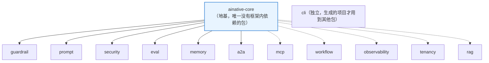

# 第2章 —— 全书地图：13个包，13种生产事故

## 先看全局，再钻进细节

学一个大型框架最容易犯的错误，是一上来就扎进某个文件的第37行代码，然后完全迷失在细节里，不知道这段代码在整个系统里扮演什么角色。这一章的目的很简单：**在你读任何一行代码之前，先在脑子里建立起一张地图**。

## 13个包，对应13种"如果没有它会发生的真实事故"

下面这张表，是整本书的骨架。每一行都对应本书的一个部分，"如果没有它会怎样"这一列，才是你真正需要记住的东西——包名可以忘，但"这类问题该怎么应对"不能忘。

| 包 | 一句话职责 | 如果没有它，会发生的真实事故 |
|---|---|---|
| `ainative-core` | 地基：接口定义+跨厂商模型工厂 | 换一个模型厂商要重写一遍所有业务代码 |
| `ainative-guardrail` | Agent运行时护栏 | 一个卡死循环的Agent，把整月的API预算在一晚上烧光 |
| `ainative-prompt` | Prompt版本管理与A/B测试 | 改了一版Prompt效果变差，却不知道是哪次改动导致的 |
| `ainative-security` | 输出安全扫描+PII脱敏 | 用户的手机号被原样存进日志，或者被提示词注入攻击套出内部信息 |
| `ainative-eval` | 上线前的治理门禁 | "这个Agent到底能不能上线"全凭产品经理拍脑袋 |
| `ainative-memory` | 长期记忆与历史裁剪 | 对话越聊越长，某天突然超出模型上下文窗口直接报错 |
| `ainative-mcp` | 工具调用配置与审计 | 子进程不小心继承了你的API密钥，泄露给了不受信任的代码 |
| `ainative-workflow` | 多阶段任务编排 | 一个需要人工审批的操作被自动"批准"放行 |
| `ainative-a2a` | 多智能体协作 | 两个Agent互相委派任务，形成死循环，服务器被打满 |
| `ainative-cli` | 项目脚手架 | 每次开新项目都要手动拼凑十几个文件的初始配置 |
| `ainative-observability` | 结构化日志与追踪 | 线上出问题时，几十条`print`语句里根本翻不出真正的原因 |
| `ainative-tenancy` | 多租户隔离 | A公司的员工不小心查到了B公司的数据 |
| `ainative-rag` | 检索增强生成 | AI一本正经地编造了一个不存在的产品条款 |

## 依赖关系：一张图看懂谁依赖谁

记住这条规则（这是整个框架最重要的架构约束，后面几乎每章都会提到）：**除了`ainative-core`，其余12个包互相之间永远不允许依赖**。`ainative-a2a`不能依赖`ainative-workflow`，`ainative-rag`不能依赖`ainative-memory`。这样设计的好处是——你可以只安装你需要的那一两个包，不会被迫拖进一整条依赖链。这是"真正独立可插拔"的具体体现，不是一句空话。

## 怎么读这本书

1. **每章都对照真实代码读**——书里引用的每一段代码，在`packages/`目录下都能找到一模一样的文件，路径会在章节里明确标出。
2. **"动手做"小节不要跳过**——这本书假设你会在自己电脑上真的执行命令，而不是只用眼睛看。
3. **顺序读比跳读效果更好**——第五部分讲的"治理门禁"会用到第二部分"护栏"的概念，第十四部分的综合实战会同时用到前面十三个部分的内容。如果你已经对某个包很熟，可以跳过对应部分，但建议至少通读一遍目录里的"如果没有它会怎样"这一列。
4. **每部分结束后，去跑一下对应的真实示例**——`examples/products/`目录下有十几个贴近真实业务场景的可运行脚本，本书第十四部分会详细走查其中几个，但你完全可以提前去跑一跑、看看输出。

## 本章小结

- 13个包对应13类"真实会发生的生产事故"，记住"事故"比记住"包名"更重要。
- 除`ainative-core`外，包与包之间永远不互相依赖，这是"可插拔"的核心保证。
- 读这本书的正确姿势：对照真实代码、动手运行、按顺序推进。

## 动手做

打开`packages/`目录，数一数确实是13个包；再打开根目录的`README.md`，找到"Architecture overview"这一节的Mermaid图，跟上面这张简化图对比一下，看看能不能看懂完整版里多出来的细节。

## 面试可能会问

**问：如果要新增一个AI Native的能力模块，你会怎么决定它该不该依赖已有的模块？**

答题思路：可以直接引用这个框架的设计原则——"每个新包只应该依赖最基础的公共接口层（比如这里的`ainative-core`），不应该依赖同级的其他能力模块"，并说明理由：这样任何一个模块都可以被单独抽取复用，不会因为一个模块的bug或者变更，牵连到一堆看似无关的其他模块。
