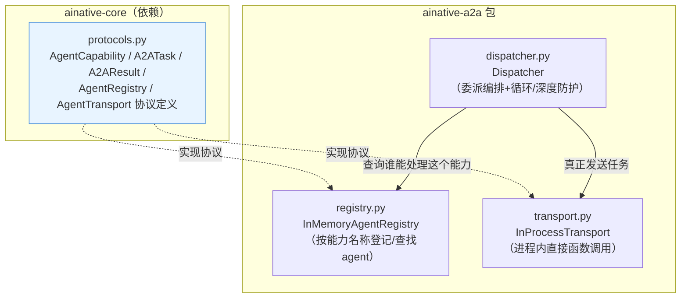
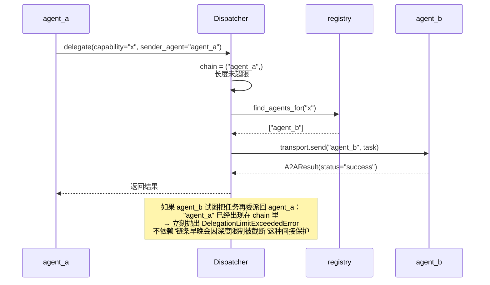

# ainative-a2a

Agent间任务委派、结果回传、能力注册与发现——只依赖 `ainative-core`。

## 这个包解决什么问题

当一个系统里有多个分工不同的智能体（agent）时，会遇到：

- agent A怎么知道"谁能处理这类任务"，而不是硬编码写死目标agent的名字？
- 委派任务给别的agent时，会不会不小心委派成一个死循环（A委派给B、B又委派回A）？
- 委派链条太长（比如A→B→C→D→...）算不算一种失控信号，要不要设个上限？

`ainative-a2a` 用三个文件分别回答这三个问题：`registry.py`（能力注册与发现）、`dispatcher.py`（委派编排+循环/深度防护）、`transport.py`（真正把任务发出去的具体方式，默认是进程内直接函数调用）。

## 内部结构



**依赖关系解读**：`Dispatcher`是编排的核心——它自己不知道"具体有哪些agent"（这是`registry`的职责），也不知道"任务具体怎么送达"（这是`transport`的职责），只负责把两者串起来，并且在每次委派前做深度检查、委派后做循环检查。这种"组合而不是继承"的设计，让三个模块可以独立测试、独立替换（比如真实项目想接入HTTP传输，只需要写一个新的`AgentTransport`实现，不需要改动`Dispatcher`或`registry`）。

## 委派链路的循环/深度防护怎么工作的



## 这次加固中修复的两个真实bug

1. **`InMemoryAgentRegistry`的别名污染bug**：`AgentCapability`虽然是"冻结"的数据类，但它的`input_schema`/`output_schema`字段本身是普通可变字典——`register()`/`get_capability()`/`capabilities_of()`现在都对这些字段做深拷贝，防止调用方拿到能力描述后原地修改，静默污染注册表内部状态。
2. **`DelegationLimitExceeded`重命名为`DelegationLimitExceededError`**：为了和框架里其余所有异常类保持一致的命名规范（异常类名统一以`Error`结尾）。

## 快速上手

```python
from ainative_a2a.registry import InMemoryAgentRegistry
from ainative_a2a.transport import InProcessTransport
from ainative_a2a.dispatcher import Dispatcher, DelegationLimitExceededError
from ainative_core.protocols import AgentCapability, A2ATask

registry = InMemoryAgentRegistry()
registry.register("billing_specialist", AgentCapability(
    name="resolve_billing_dispute", description="Handles billing disputes",
))

transport = InProcessTransport()

async def handle_billing_task(task: A2ATask) -> dict:
    return {"resolution": f"Reviewed case: {task.payload}"}

transport.register_handler("billing_specialist", handle_billing_task)

dispatcher = Dispatcher(registry, transport)
result = await dispatcher.delegate(
    capability="resolve_billing_dispute", payload={"case": "..."}, sender_agent="coordinator",
)
print(result.status, result.output)
```
