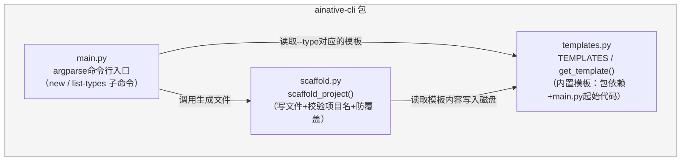
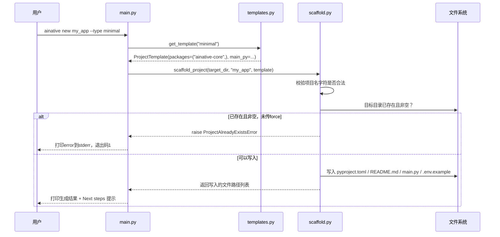

# ainative-cli

一条命令生成AI Native项目骨架——`ainative new <project-name> --type <type>`。不依赖`ainative-core`或框架内任何其他包，是唯一独立于整个框架、可以单独安装使用的包。

## 这个包解决什么问题

从零搭建一个使用AI Native Framework的新项目时，会遇到几个重复性的麻烦：

- 每次都要手写`pyproject.toml`、`README.md`、`.env.example`这类样板文件，还要记住这次要用哪些`ainative-*`包做依赖。
- 不同类型的项目（客服agent、浏览器自动化agent、多agent协作系统……）该怎么组合各个包、`main.py`的起始代码大致长什么样，新人很难凭空知道。
- 手写这些样板文件容易出低级错误——比如项目名里不小心带了双引号，直接把生成的`pyproject.toml`写成语法错误的文件。

`ainative-cli`用三个模块分别回答：`templates.py`（内置几种项目类型模板，声明各自需要的包+起始代码）、`scaffold.py`（把模板真正写到磁盘上，同时校验项目名合法性、保护已有目录不被误覆盖）、`main.py`（`argparse`命令行入口，把两者串起来）。

## 内部结构



**依赖关系解读**：`ainative-cli`本身的`pyproject.toml`里`dependencies = []`——它在运行时不依赖`ainative-core`或框架里任何其他包。四种内置模板（`templates.py`里的`_CUSTOMER_SERVICE_MAIN`等）里出现的`from ainative_core.config import ...`这类import语句，只是作为**纯文本字符串**存在，会被原样写入生成的新项目的`main.py`文件里——那是"给新项目用的代码"，不是"这个CLI包自己要运行的代码"，所以`ainative-cli`本身不需要真的安装`ainative-core`才能工作；只有用户接下来在生成的新项目目录里执行`uv sync`时，才会真正安装模板里声明的那些包。

## `ainative new` 生成文件的完整流程



## 快速上手

```python
from pathlib import Path
from ainative_cli.scaffold import scaffold_project
from ainative_cli.templates import get_template

template = get_template("minimal")
written = scaffold_project(Path("./my_app"), "my_app", template)
print([p.name for p in written])
# ['pyproject.toml', 'README.md', 'main.py', '.env.example']
```

或者直接用命令行（包安装后会注册`ainative`这个可执行命令，见`pyproject.toml`里的`[project.scripts]`）：

```bash
ainative list-types
ainative new my_app --type customer-service
cd my_app && uv sync && uv run python main.py
```

## 一处值得注意的设计：项目名的字符校验

`scaffold.py`里的`_VALID_PROJECT_NAME_RE`只允许项目名以字母/数字开头、其余只能是字母/数字/`.`/`_`/`-`。这条限制不是随意加的：`project_name`会被`render_pyproject_toml`/`render_readme`原样拼进生成的TOML字符串字面量和Markdown文本里——docstring里特别注明"已用真实输入复现过"，说明这不是纸上谈兵的假设性风险，而是真实遇到过"项目名里带了双引号或换行符，导致生成出来的`pyproject.toml`本身就是语法错误的文件，`uv sync`直接失败"这个具体故障后，才补上的输入校验。这也是`InvalidProjectNameError`（继承`ValueError`，代表"参数值本身不合法"）与`ProjectAlreadyExistsError`（继承`RuntimeError`，代表"当前状态导致操作无法继续"）在这个包里被刻意区分成两种不同异常基类的原因。
