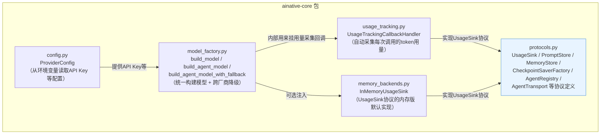
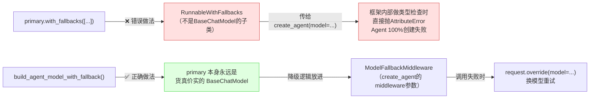

# ainative-core

AI Native Framework 的核心地基——不依赖任何具体数据库/中间件产品，其余12个包都只依赖这一个包，互相之间不依赖。

## 这个包解决什么问题

任何一个"调用大模型"的项目，都会重复遇到几个问题：

- 换一家供应商（Anthropic → OpenAI）要改一遍调用代码怎么办？
- 主力供应商突然连不上了，要不要自动切换备用供应商？
- 每次调用花了多少token/多少钱，怎么统一记录？
- 项目的配置（API Key等）不想和这个包绑死，怎么办？

`ainative-core` 用四个文件分别回答这四个问题，并且**只定义"需要具备什么行为"（Protocol协议），不假设"具体用什么数据库/中间件去实现这个行为"**——这样其余12个包（以及真实项目自己）都可以在不改动这个包代码的前提下，接入自己的真实基础设施。

## 内部结构



**依赖关系解读**：`protocols.py`是这个包真正的"地基中的地基"——它只定义接口，不依赖本包任何其他文件。`config.py`独立存在。`usage_tracking.py`实现了`protocols.py`里的`UsageSink`接口。`model_factory.py`是这个包里逻辑最复杂的文件，它组合使用了前三者：读`config.py`拿配置、按需调用`usage_tracking.py`挂用量采集回调、构建出真正可用的LangChain模型对象。`memory_backends.py`提供了`UsageSink`协议最简单的一种实现（内存列表），供demo/测试直接使用，不需要接真实数据库。

## 跨厂商降级为什么不能用 `.with_fallbacks()`

这是本包一个刻意保留、绝对不能"顺手简化掉"的设计约束（`model_factory.py`模块docstring里称为"ch53-01历史事故的教训"）：



## 快速上手

```python
from ainative_core.config import ProviderConfig
from ainative_core.model_factory import build_agent_model_with_fallback
from ainative_core.memory_backends import InMemoryUsageSink

config = ProviderConfig.from_env()  # 从环境变量读取 ANTHROPIC_API_KEY 等
usage_sink = InMemoryUsageSink()

model, fallback_middleware = build_agent_model_with_fallback(
    config=config, usage_sink=usage_sink, agent_name="my_agent",
)
# model 可以直接传给 create_agent(model=model, middleware=[fallback_middleware, ...])
# 每次调用结束后，usage_sink.events 里会自动多一条用量记录
```
