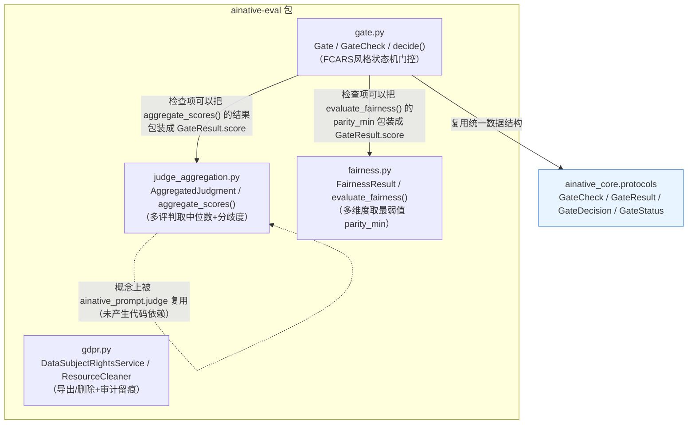
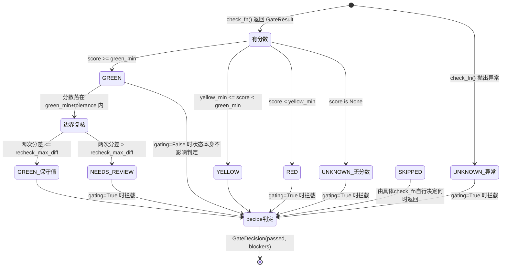
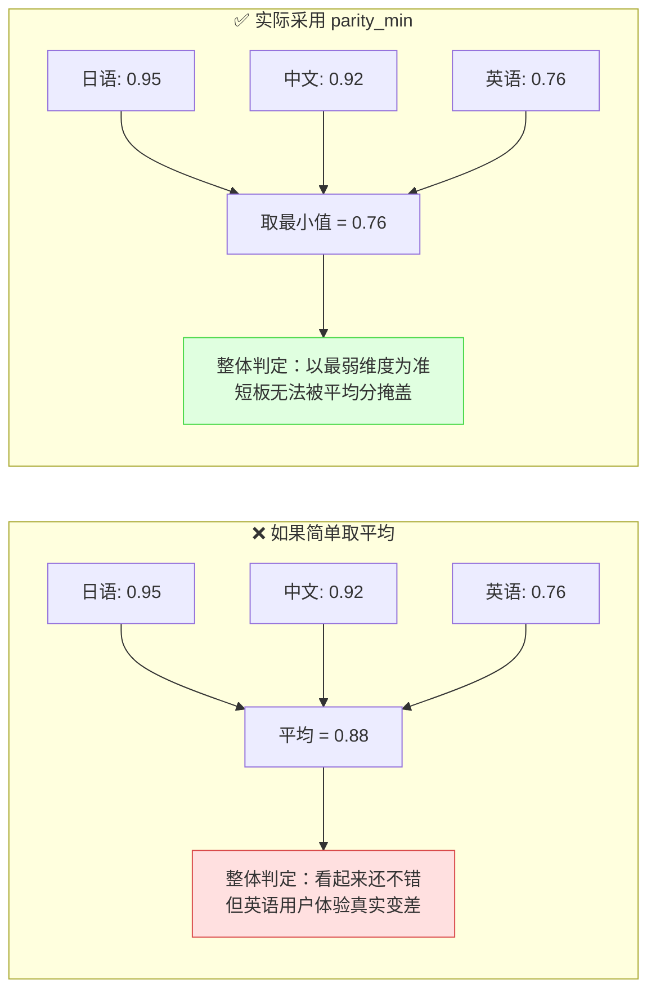

# ainative-eval

FCARS风格治理门控、独立多评判聚合、公平性评分、GDPR数据主体权利——只依赖`ainative-core`。

## 这个包解决什么问题

任何一个"用LLM辅助做判断/评分/放行决策"的项目，都会重复遇到几个问题：

- 部署前要跑一堆检查（安全/合规/可靠性……），怎么统一收集结果、统一判定"能不能放行"？
- 用LLM当裁判打分，同一个问题问两次分数可能不一样，怎么知道这次的分数靠不靠谱？
- 同一个功能在不同语言/不同人群上体验不一样，该怎么衡量"公平"，简单平均行不行？
- 用户要求"导出我的数据"/"删除我的数据"（GDPR权利），数据散落在好几个存储里，怎么保证不漏、留痕？

`ainative-eval`用四个文件分别回答这四个问题：`gate.py`提供一个通用的GREEN/YELLOW/RED状态机，`judge_aggregation.py`提供"多次评判取中位数+分歧度"的聚合规则，`fairness.py`提供"取最弱维度而非平均"的公平性聚合，`gdpr.py`提供"导出/删除+审计留痕"的骨架服务。

## 内部结构



**依赖关系解读**：`gate.py`是这个包的核心，它的数据结构（`GateCheck`/`GateResult`/`GateDecision`/`GateStatus`）实际定义在更底层的`ainative_core.protocols`里（和`ainative-core`的README解释的道理一致：协议定义在最底层，具体判定逻辑在上层）。`judge_aggregation.py`和`fairness.py`都是独立的纯函数聚合层，不依赖`gate.py`，但常见用法是把它们的聚合结果包装成一个`GateResult`，注册进`Gate`跑统一判定。`gdpr.py`自成一块，不依赖本包其他模块。`judge_aggregation.py`的聚合规则和`ainative_prompt.judge`使用的是同一套算法，但两者故意没有代码依赖——`ainative-prompt`和`ainative-eval`都只依赖`ainative-core`，互相之间不产生依赖。

## Gate 状态机：GREEN / YELLOW / RED / UNKNOWN / SKIPPED / NEEDS_REVIEW



**关键点**：`NEEDS_REVIEW`不是"确认失败"，而是"分数在阈值边界、复核结果不稳定，需要人来最终确认"——但它在`decide()`里和`RED`/`UNKNOWN`一样会被计入`blockers`（拦截），因为治理门控的默认立场是"不确定就不能自动放行"。只有`gating=False`（warn-only）的维度，无论状态如何都不会真正拦截，只作记录。

## `fairness.py` 为什么用 `parity_min` 而不是平均分



`evaluate_fairness()`对一组`FairnessDimensionScore`（每个维度各自的0-1分）取`min()`，把`parity_min`和对应的`weakest_dimension`一起返回，同时保留`dimension_scores`供排查每个维度各自的原始分数。

## 快速上手

```python
from ainative_eval.gate import Gate, GateCheck, status_from_score, maybe_recheck_boundary
from ainative_core.protocols import GateResult
from ainative_eval.judge_aggregation import aggregate_scores
from ainative_eval.fairness import FairnessDimensionScore, evaluate_fairness
from ainative_eval.gdpr import DataSubjectRightsService, InMemoryAuditSink

# 1. 独立调用judge模型3次，得到3个分数，聚合成中位数 + 分歧度标记
judged = aggregate_scores([0.82, 0.79, 0.90])
status = status_from_score(judged.score, green_min=0.8, yellow_min=0.6)

# 2. 落在边界时触发一次复核（这里演示手写rescore逻辑）
final_score, needs_review, note = maybe_recheck_boundary(
    judged.score, green_min=0.8, boundary_tolerance=0.05, recheck_max_diff=0.1,
    rescore=lambda: 0.81,
)

# 3. 把这次评分结果注册成一个检查项，跑统一的Gate判定
def check_llm_judge_score() -> GateResult:
    return GateResult(
        dimension="response_quality", gating=True, status=status,
        detail=note or "single-pass score, no boundary recheck triggered",
        score=final_score,
    )

gate = Gate([GateCheck(name="response_quality", gating=True, check_fn=check_llm_judge_score)])
decision = gate.run()
if not decision.passed:
    print(decision.blockers)

# 4. 跨语言公平性：取最弱维度而不是平均分
fairness_result = evaluate_fairness([
    FairnessDimensionScore(dimension="ja", score=0.95),
    FairnessDimensionScore(dimension="zh", score=0.92),
    FairnessDimensionScore(dimension="en", score=0.76),
])
print(fairness_result.parity_min, fairness_result.weakest_dimension)  # 0.76 "en"

# 5. GDPR数据主体权利：注册每一类存储各自的清理器，导出/删除自动写审计
service = DataSubjectRightsService(audit_sink=InMemoryAuditSink())
# service.register_cleaner(ConversationHistoryCleaner())
# service.register_cleaner(CheckpointCleaner())
# exported = service.export_my_data(user_id="u123")
# deleted_counts = service.delete_my_data(user_id="u123")
```
