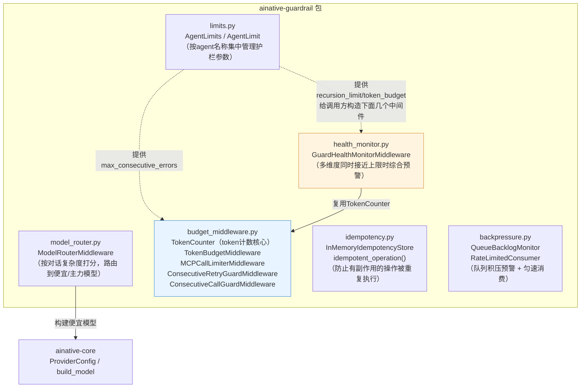
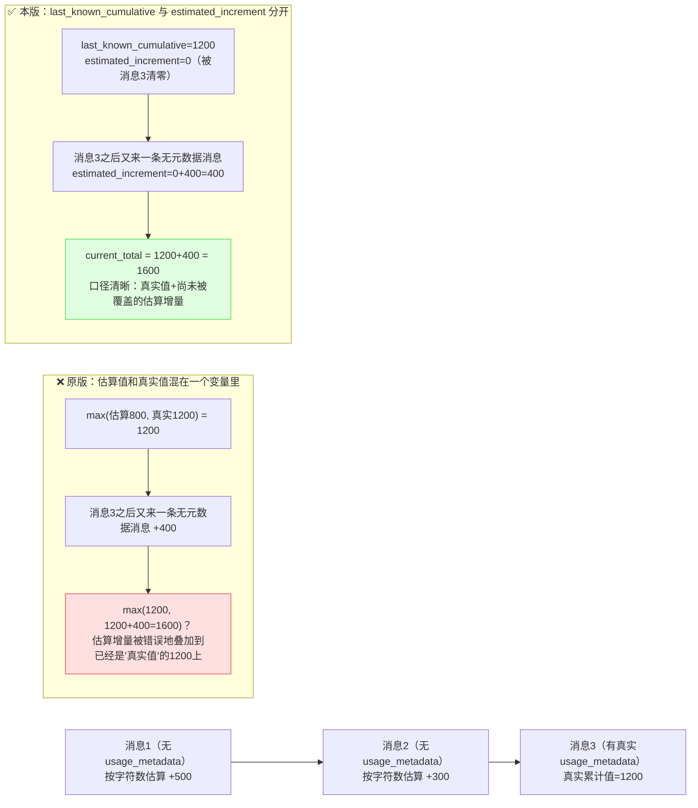

# ainative-guardrail

Agent运行期护栏——只依赖`ainative-core`，负责"Agent真正跑起来之后，怎么防止它失控"这一类问题。

## 这个包解决什么问题

任何一个真正投入生产的Agent，都会遇到几类"跑起来才会暴露"的风险：

- 模型很贵，但不是每一轮对话都需要用最贵的模型，怎么自动省钱？
- 同一个工具被反复调用/反复失败，怎么防止陷入无效循环、烧光预算？
- 多层护栏各自独立触发终止，但有没有"任务正在滑向失控"的综合预警？
- 客户端重试导致同一个有副作用的操作被执行两次，怎么防止？
- 后台任务队列积压到下游扛不住了才发现，怎么提前预警？

`ainative-guardrail`用七个文件分别回答这些问题，全部是纯内存实现，互相之间尽量零耦合（除了`health_monitor.py`复用`budget_middleware.py`里的`TokenCounter`），可以按需独立选用、任意组合到`create_agent(middleware=[...])`里。

## 内部结构



**依赖关系解读**：`limits.py`是一个纯配置容器，不依赖本包任何其他文件，通常由调用方在启动时读取，用来决定要给下面几个中间件传什么参数（图中的虚线箭头表示"提供配置数值"，不是代码import依赖）。`model_router.py`是唯一真正import了`ainative-core`的文件——它需要`build_model()`来构建"便宜模型"。`budget_middleware.py`是这个包逻辑最复杂、也是唯一被其他模块复用的文件：`TokenCounter`这个类被单独设计出来，专门负责"正确地统计token用量"，`health_monitor.py`直接复用它，避免维护两份可能行为不一致的计数逻辑。`idempotency.py`和`backpressure.py`是两个完全独立的工具模块，不是`AgentMiddleware`，服务于Agent之外更广义的"有副作用的操作/任务队列"场景。

## `TokenCounter`：一个真实bug修复留下的设计约束

`budget_middleware.py`模块docstring记录了两处从真实生产项目里发现并修复的逻辑缺陷，其中第一处（累计值与估算值混用）直接决定了`TokenCounter`为什么要把两个数字分开维护，而不是像最初那样揉进一个变量里用`max()`比较：



`TokenBudgetMiddleware`和`GuardHealthMonitorMiddleware`都通过`current_total`读取"当前最佳估计总量"，口径完全一致；`last_known_cumulative`则专门暴露给需要"只看最近一次真实数据"的场景使用，两者不应混淆。

## 快速上手

```python
from langchain.agents import create_agent
from langchain.agents.middleware import ModelFallbackMiddleware

from ainative_core.config import ProviderConfig
from ainative_core.model_factory import build_agent_model_with_fallback
from ainative_guardrail import (
    AgentLimits,
    ConsecutiveRetryGuardMiddleware,
    GuardHealthMonitorMiddleware,
    ModelRouterMiddleware,
    TokenBudgetMiddleware,
)

config = ProviderConfig.from_env()

# 1. 集中管理这个agent的护栏参数
limits = AgentLimits()
limits.register("my_agent", recursion_limit=80, token_budget=300_000, max_consecutive_errors=3)

# 2. 构建模型（主力模型 + 跨厂商降级，来自 ainative-core）
model, fallback_mw = build_agent_model_with_fallback(config=config, agent_name="my_agent")

# 3. 组合护栏中间件——顺序很重要：越靠前越是"外层"，越晚接触到最终结果
middleware = [
    ModelRouterMiddleware("my_agent", config=config),                     # 便宜/主力模型路由
    TokenBudgetMiddleware(limits.token_budget("my_agent")),                # 预算耗尽即短路
    ConsecutiveRetryGuardMiddleware(limits.max_consecutive_errors("my_agent")),  # 连续失败即短路
    GuardHealthMonitorMiddleware(                                         # 纯预警，不改变终止判断
        recursion_limit=limits.recursion_limit("my_agent"),
        token_budget=limits.token_budget("my_agent"),
    ),
]
if fallback_mw is not None:
    middleware.append(fallback_mw)

agent = create_agent(
    model=model,
    middleware=middleware,
)
```

对于"有副作用、不能被重复执行"的操作（比如扣款、发送通知），单独用`idempotent_operation()`包裹：

```python
from ainative_guardrail import (
    DuplicateOperationError,
    IdempotencyStatus,
    InMemoryIdempotencyStore,
    idempotent_operation,
)

store = InMemoryIdempotencyStore()

try:
    with idempotent_operation(store, "charge:order-42"):
        result = charge_credit_card(order_id="order-42")
        store.complete("charge:order-42", result, ttl_seconds=3600)
except DuplicateOperationError as exc:
    if exc.record.status is IdempotencyStatus.COMPLETED:
        result = exc.record.result  # 直接复用之前的结果，不重复扣款
    else:
        result = "please retry shortly"  # 仍在处理中
```
