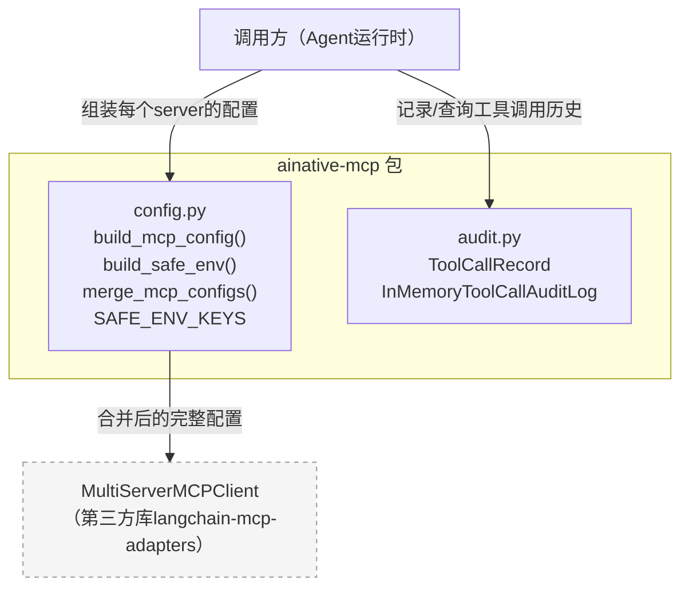
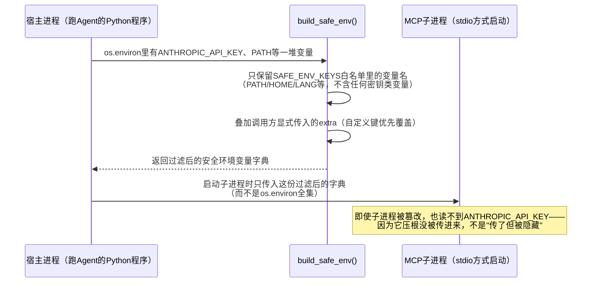

# ainative-mcp

MCP（Model Context Protocol）server配置组装、stdio子进程环境变量安全白名单、工具调用审计schema——只依赖 `ainative-core`。

## 这个包解决什么问题

当一个Agent需要同时接入多个MCP server（比如一个操作浏览器、一个查文件系统、一个查数据库）时，会遇到三个具体问题：

- 每个server要的配置字典长得都不太一样（http需要`url`/`headers`，stdio需要`command`/`args`/`env`），手写容易漏字段或塞进无意义的空值。
- stdio方式本质是本机启动一个子进程，子进程默认会继承父进程的全部环境变量——如果父进程环境里有`ANTHROPIC_API_KEY`之类的密钥，稍不注意就会连同其它变量一起原样传给子进程，一旦子进程被篡改或本身有问题，密钥就有泄露风险。
- 工具调用发生之后，想知道"哪个agent、调用了哪个工具、成功没成功、花了多久"，需要一份统一的审计记录格式，而不是每个项目各自定义一套字段。

`ainative-mcp` 用两个文件分别回答这些问题：`config.py`（配置组装 + 环境变量白名单过滤）、`audit.py`（工具调用审计记录的通用schema + 内存版存储）。

## 内部结构



**依赖关系解读**：`config.py`和`audit.py`彼此完全独立，互不引用——一个负责"连接前"的配置组装，一个负责"调用后"的审计记录，两者只是恰好都属于"MCP相关的配套设施"这同一个主题，所以放在同一个包里。这个包本身不依赖`ainative-core`的任何具体类型（不像`ainative-a2a`依赖`protocols.py`里的Protocol定义），是本框架里为数不多"零框架内部依赖、只用标准库"的包。

## 环境变量白名单是怎么工作的



## 这次加固中修复的真实bug

**`merge_mcp_configs`的别名污染bug**：合并多份server配置时，原来的写法是`merged.update(config)`——字典的`.update()`对嵌套的dict/list只会复制"引用"，不会真正复制一份新数据。如果调用方的使用模式是"构造一次配置模板、合并进最终配置、再按每次请求临时改某个字段（比如刷新一个auth token）"，修改合并后的结果会静默污染调用方仍持有的原始模板，导致认证信息在本该独立的请求之间意外串联。现在改为`merged.update(copy.deepcopy(config))`，合并结果与传入的原始配置完全独立、互不共享任何嵌套对象。

## 快速上手

```python
from ainative_mcp import build_mcp_config, build_safe_env, merge_mcp_configs
from ainative_mcp import InMemoryToolCallAuditLog, ToolCallRecord

# 1. 组装两个server的配置——一个走http，一个走stdio
http_cfg = build_mcp_config("search", transport="http", url="http://localhost:9000/mcp")
fs_cfg = build_mcp_config(
    "filesystem", transport="stdio",
    command="npx", args=["-y", "@modelcontextprotocol/server-filesystem", "/workspace"],
    env=build_safe_env(extra={"MCP_ROOT": "/workspace"}),
)

# 2. 合并成MultiServerMCPClient需要的完整配置字典
full_config = merge_mcp_configs(http_cfg, fs_cfg)
# full_config == {"search": {...}, "filesystem": {...}}

# 3. 记录一次工具调用的审计信息
audit_log = InMemoryToolCallAuditLog()
audit_log.record(ToolCallRecord(
    tool_name="read_file", agent_name="research_agent",
    status="success", duration_ms=42.0,
))
print(audit_log.error_rate())  # 0.0
```
