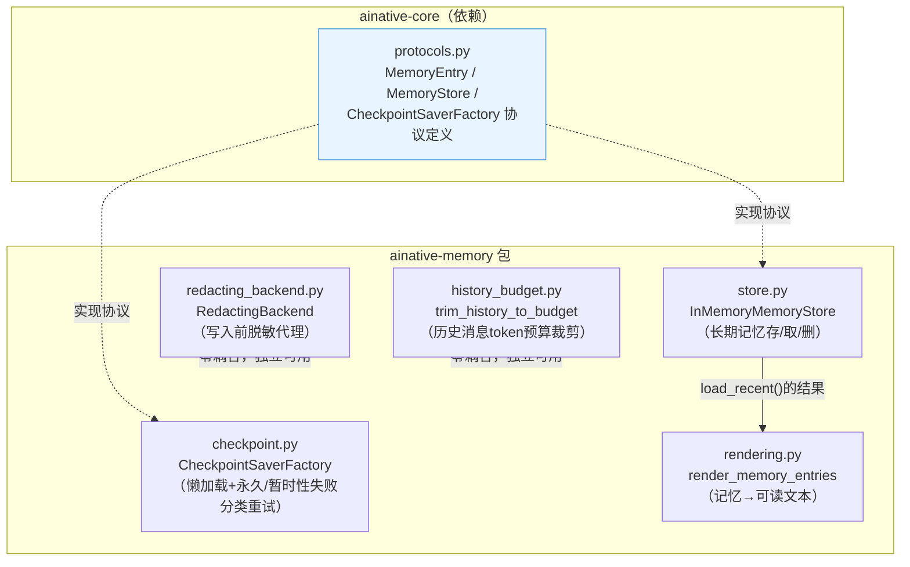
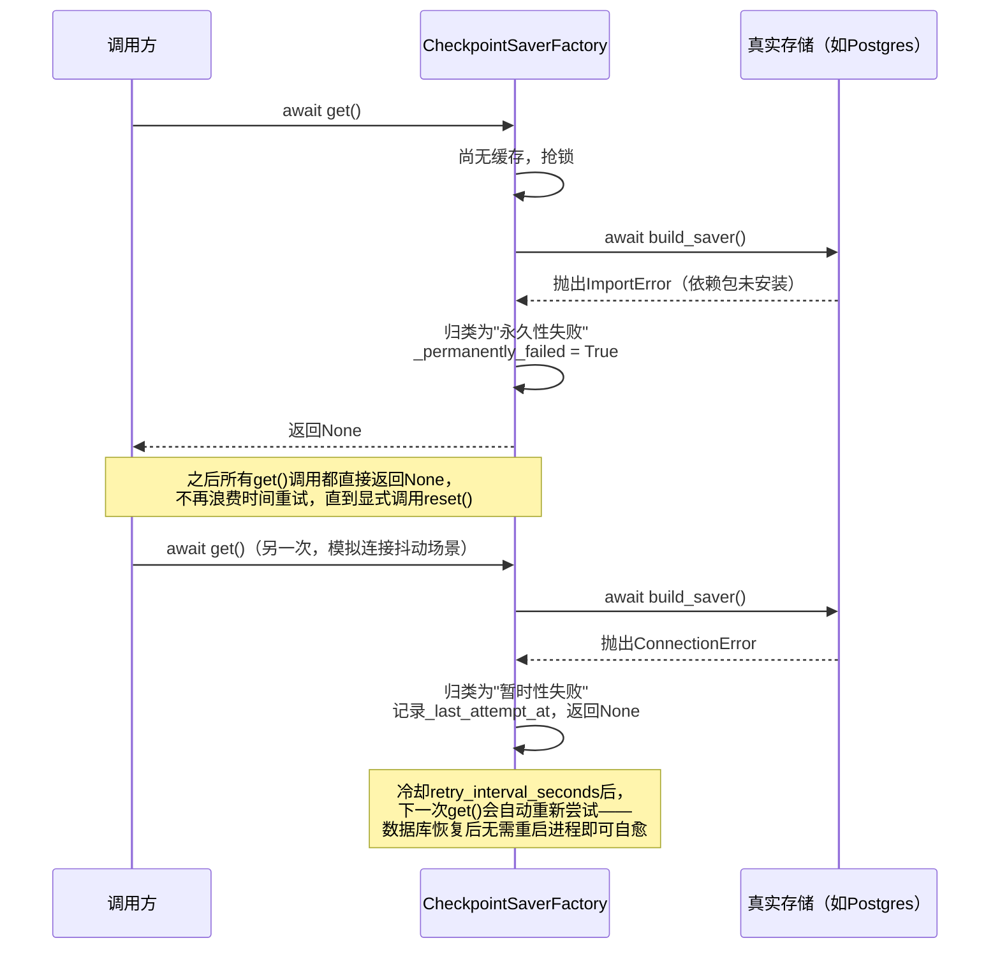

# ainative-memory

Checkpoint持久化、长期记忆存储、PII脱敏代理、历史token预算裁剪——只依赖 `ainative-core`。

## 这个包解决什么问题

一个能"记住"之前对话/执行状态的Agent，实际上需要解决四个互相独立的子问题：

- **断点续跑**：Agent执行中途进程重启了，怎么从上次中断的地方继续，而不是从头再来？连接底层存储（Postgres/Redis等）本身还可能暂时失败，该怎么办？
- **长期记忆**：跨多次对话/多个章节，怎么存取"这个用户/这次会话之前发生过什么"，又不让这份记忆无限膨胀？
- **落盘前的隐私保护**：如果对话历史因为太长被"摘要压缩后落盘"，落盘的内容里混进了用户的手机号/邮箱怎么办？
- **历史消息的token预算**：随着对话轮数增长，`conversation_history`本身也会占用大量token——如果只顾着给检索文档、系统提示词精打细算token预算，却唯独忘了限制历史消息，最终prompt仍可能超出模型上下文窗口。

`ainative-memory` 用四个模块分别回答这四个问题：`checkpoint.py`（存储句柄懒加载工厂+失败分类重试）、`store.py`（长期记忆的存/取/删）、`redacting_backend.py`（写入前脱敏的代理）、`history_budget.py`（历史消息的token预算裁剪），外加`rendering.py`把裁剪后的记忆渲染成可读文本。

## 内部结构



**依赖关系解读**：五个模块里，`checkpoint.py`、`store.py`、`rendering.py`这三者围绕"记忆的存取与展示"这条主线（`store`存取记忆条目，`rendering`把取出来的记忆渲染成文本），而`redacting_backend.py`和`history_budget.py`是完全独立、彼此互不依赖的两个工具——分别解决"落盘前脱敏"和"历史消息预算裁剪"这两个横切关注点，可以单独拿去用在任何符合各自接口约定的场景，不需要连带引入这个包的其他部分。

## 懒加载 + 失败分类重试是怎么工作的



## 快速上手

```python
from ainative_memory import (
    InMemoryMemoryStore, render_memory_entries,
    trim_history_to_budget, wrap_summarization_backend,
)
from ainative_core.protocols import MemoryEntry

# 1. 存取长期记忆
store = InMemoryMemoryStore()
await store.append(MemoryEntry(owner_id="user_1", sequence=1, content="用户偏好深色主题"))
recent = await store.load_recent("user_1", max_items=5)
print(render_memory_entries(recent))
# ## Memory #1
# 用户偏好深色主题

# 2. 裁剪对话历史，控制token预算
history = [{"content": "..."}] * 100
trimmed = trim_history_to_budget(history, max_tokens=2000)

# 3. 包装文件系统backend，摘要落盘前自动脱敏
def redact(text: str) -> str:
    return text.replace("13800138000", "[REDACTED_PHONE]")

safe_backend = wrap_summarization_backend(real_backend, redact_fn=redact)
```

## 这次加固中修复的真实bug

**`InMemoryMemoryStore`的别名污染bug**：`MemoryEntry`虽然是frozen dataclass，但它的`metadata`字段是普通可变dict。`append()`/`load_recent()`原本直接存储/返回调用方传入或即将返回的原始对象——如果调用方复用同一个可变dict作为"元数据模板"构造多条记忆，或者拿到`load_recent()`的结果后修改了某条的`metadata`，会静默篡改内部真正存储的历史记忆。现在通过`dataclasses.replace(entry, metadata=copy.deepcopy(entry.metadata))`，在存入和取出两端都做深拷贝，与本框架中`merge_mcp_configs`、`InMemoryAgentRegistry`修复的是同一类问题。
