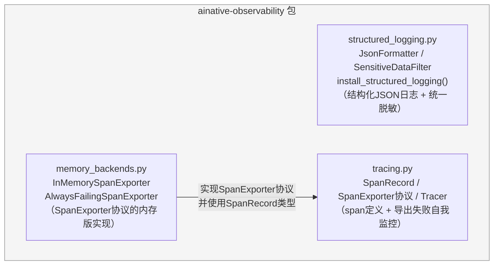
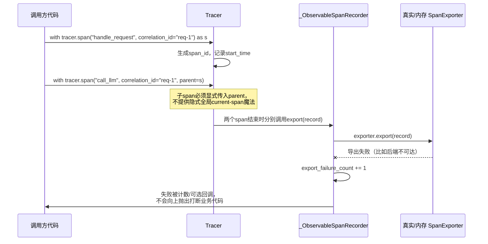

# ainative-observability

结构化JSON日志、统一敏感信息过滤器、轻量级追踪span记录——不强依赖OpenTelemetry等外部追踪后端，也不需要额外的基础设施就能跑通demo/测试。

## 这个包解决什么问题

一个正在运行的系统，出了问题之后往往只能靠日志和追踪数据去排查，但这两类数据本身很容易带来两个具体隐患：

- 日志如果是靠字符串拼接（比如f-string）写出来的纯文本，就没法按字段查询/过滤，而且一旦有人图省事把密码、API密钥、token这类敏感数据拼进了消息文本，脱敏逻辑如果只挂在"正常"调用路径上，debug开关一开、或者某个调用点忘了脱敏，敏感信息就会原样写进日志文件。
- 分布式追踪（span）如果导出到后端这一步本身失败了却被静默吞掉，会出现"系统看起来在做追踪、实际上数据已经悄悄丢失"且长期没人发现的情况；另外如果不同层级（HTTP请求、追踪系统、业务框架）各自维护一套不互相关联的ID，事后也没法把同一次请求内部发生的事情串起来看。

`ainative-observability` 用三个模块分别回答：`structured_logging.py`（把日志变成结构化JSON，并用一个统一挂载在Handler上的过滤器无差别脱敏所有日志）、`tracing.py`（span的核心定义和`Tracer`，强制要求关联ID、子span显式声明父节点，导出失败自我监控）、`memory_backends.py`（`SpanExporter`协议的内存版默认实现，供demo/测试使用，不需要真实追踪后端）。

## 内部结构



**依赖关系解读**：`structured_logging.py`和`tracing.py`/`memory_backends.py`这两条链路彼此完全独立、互不依赖——日志和追踪是两类不同的可观测性数据，各自可以单独使用。包内唯一的真实代码依赖是`memory_backends.py`导入`tracing.py`的`SpanRecord`类型（`InMemorySpanExporter`需要知道怎么存储和按`correlation_id`检索span记录）。`pyproject.toml`里声明了对`ainative-core`的依赖，但截至目前，`ainative-observability`的源代码里没有任何一行真正`import`了`ainative_core`的内容——这个依赖更像是为"以后可能需要复用`ainative_core`里的某些通用协议/配置"预留的接口约定，而不是当前版本实际用到的东西。

## span如何关联与自我监控失败



## 一个值得注意的设计取舍：`JsonFormatter`的双重兜底

`JsonFormatter.format()`在`json.dumps(payload, default=str, ...)`外面还包了一层`try/except`，这不是多余的防御。`default=str`只能处理"json模块本身不认识的类型"（比如自定义对象），但如果某个塞进`extra=`的值，调用它自己的`__str__`方法时会直接抛异常（测试用例`test_format_never_silently_drops_a_log_line_when_a_field_cannot_be_stringified`专门构造了这样一个类），`default=str`这层兜底自己就会先失败，导致`json.dumps(...)`本身抛出异常。如果这里不接住，日志模块默认的错误处理会让这一整条日志记录悄无声息地消失（在某些非标准Handler下甚至可能让异常直接冒出去打断调用方的业务代码）。所以`format()`退而求其次，在`except`分支里构造一份只包含最基础字段（时间戳/级别/logger名/消息本身）、外加一条`logging_error`说明的、必定能被安全序列化的兜底payload——`"结构化日志绝不能无声无息丢失一整条记录"`这个承诺，比"尽量记录完整信息"优先级更高。

## 快速上手

```python
import logging

from ainative_observability import (
    InMemorySpanExporter,
    Tracer,
    install_structured_logging,
)

# 1. 结构化JSON日志 + 自动脱敏
logger = logging.getLogger("my_service")
logger.setLevel(logging.INFO)
install_structured_logging(logger)

logger.info("user logged in", extra={"user_id": "u1", "password": "hunter2"})
# 输出的JSON里，password字段会被自动替换成 "[REDACTED]"

# 2. 轻量级追踪：span + correlation_id关联 + 导出失败自我监控
exporter = InMemorySpanExporter()
tracer = Tracer(exporter)

with tracer.span("handle_request", correlation_id="req-1") as parent:
    with tracer.span("call_llm", correlation_id="req-1", parent=parent, model="claude-sonnet"):
        pass  # 真实业务逻辑

spans = exporter.for_correlation_id("req-1")
for span in spans:
    print(span.name, span.duration_ms, span.parent_span_id)

print("导出失败次数:", tracer.export_failure_count)
```
