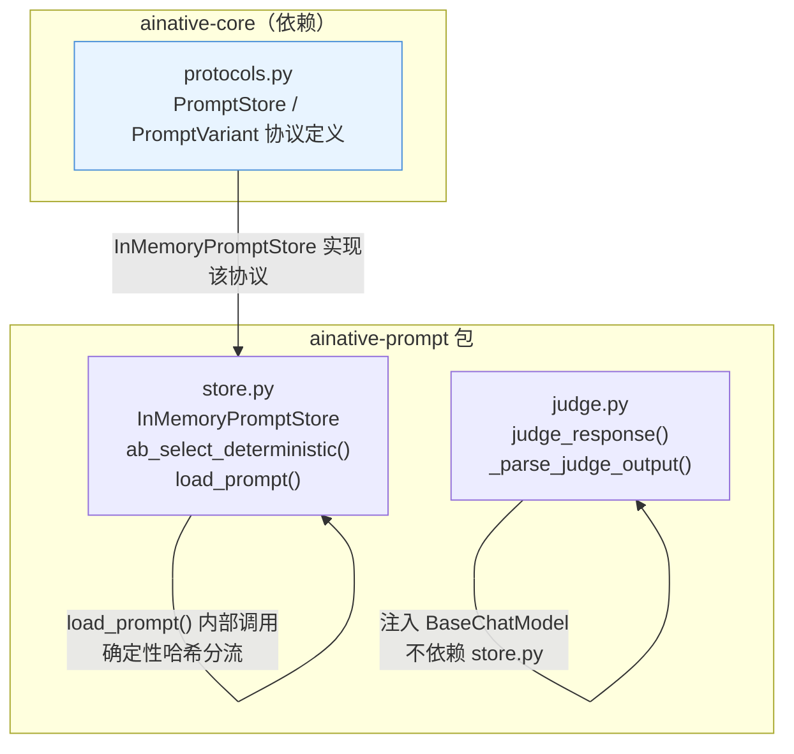
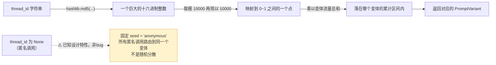

# ainative-prompt

Prompt版本管理、A/B粘性路由、LLM-as-judge评判——只依赖 `ainative-core`。

## 这个包解决什么问题

任何一个长期迭代的Agent项目，都会遇到几个和Prompt本身相关的问题：

- 想验证"新版system prompt是否比旧版更好"，怎么在生产流量上做A/B测试，又不破坏正在进行中的会话体验？
- 同一个用户/同一个会话，能不能保证每次都拿到同一个版本的Prompt，而不是每次请求都随机换一个？
- "新版prompt效果更好"这句话怎么量化？靠人工一条条看回复不现实，怎么用LLM自动打分，又不盲目相信单次判分？

`ainative-prompt` 用两个文件分别回答这些问题：`store.py` 提供Prompt版本存储 + 确定性A/B粘性路由，`judge.py` 提供多次独立评判 + 中位数聚合的LLM-as-judge。和 `ainative-core` 一样，本包**只依赖 `PromptStore` 协议描述"需要具备什么行为"**，不假设具体用什么数据库存储Prompt版本；真实项目接入时实现同一协议接入Postgres/MongoDB即可，`InMemoryPromptStore` 只是够用的内存版默认实现。

## 内部结构



**依赖关系解读**：`store.py` 依赖 `ainative-core.protocols` 里的 `PromptStore`/`PromptVariant` 定义，`InMemoryPromptStore` 是这份协议最简单的一种实现（普通dict，进程重启数据即丢失，只适合demo/测试）。`load_prompt()` 是最常用的对外入口：只有一个生效变体时直接返回，多个变体时先查有没有"粘性路由"历史记录，没有才走 `ab_select_deterministic()` 做一次确定性哈希分流并记录下来。`judge.py` 是完全独立的另一半功能，不依赖 `store.py`，只依赖调用方注入的 `BaseChatModel`，用来在评测/CI流程里给任意文本响应打分。

## 确定性A/B粘性路由怎么工作的（含一个已知设计特性）

`ab_select_deterministic()` 不用随机数做分流，而是把 `thread_id` 哈希成一个 0~1 之间的数，再按各变体的 `traffic_pct` 比例切分区间——好处是**同一个 thread_id 不管调用多少次、不管服务重启多少次，永远落在同一个区间**，不需要额外存储就能天然具备"粘性"。



**这不是bug**：`thread_id=None` 时函数用固定字符串 `"anonymous"` 当作哈希种子，所有匿名调用会稳定落在*同一个*变体上。如果业务里匿名调用占比不低，统计A/B实验显著性时，这部分流量应该单独处理或排除，不能当作已经过公平随机分流的样本——否则会得出"某个变体样本量异常集中"的误导性结论。

## 快速上手

```python
from ainative_core.protocols import PromptVariant
from ainative_prompt.store import InMemoryPromptStore, load_prompt
from ainative_prompt.judge import judge_response

# --- Prompt 版本管理 + A/B 粘性路由 ---
store = InMemoryPromptStore()
await store.save_variant(
    "my_agent", "system_prompt",
    PromptVariant(variant="default", content="You are helpful.", traffic_pct=70, version=1),
)
await store.save_variant(
    "my_agent", "system_prompt",
    PromptVariant(variant="v2_concise", content="Be concise and helpful.", traffic_pct=30, version=1),
)

# 同一个 thread_id 每次调用都会拿到同一个变体（粘性路由）
prompt_text = await load_prompt(
    store, "my_agent", default="You are helpful.", thread_id="conversation-42",
)

# --- LLM-as-judge 评测 ---
from ainative_core.model_factory import build_cheap_model  # 来自 ainative-core

judge_model = build_cheap_model(agent_name="eval_judge")
result = await judge_response(
    judge_model,
    prompt="What is the capital of France?",
    target_response="The capital of France is Paris.",
    expected_criteria="Answer must correctly name Paris as the capital.",
    judge_count=3,
)
# result = {"ok": True, "score": 1.0, "score_range": 0.0, "high_uncertainty": False, ...}
```
