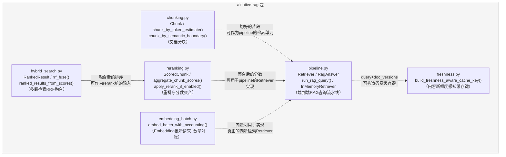
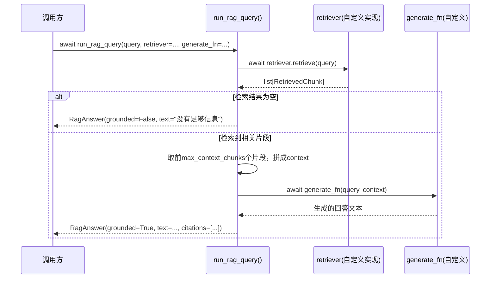

# ainative-rag

文档分块、混合检索融合(RRF)、重排序聚合、检索增强生成(RAG)流水线、Embedding批处理、内容新鲜度感知缓存键——不依赖`ainative-core`以外的任何框架内部包（虽然`pyproject.toml`声明了对`ainative-core`的依赖，但当前6个模块的代码本身没有实际import它，是完全自包含的一组设计模式实现）。

## 这个包解决什么问题

RAG（Retrieval-Augmented Generation，检索增强生成）是让大语言模型回答问题时，先从一个专门准备的知识库（比如公司内部文档）里检索出最相关的资料片段，再把这些片段当作"参考资料"连同问题一起交给模型生成回答——这样回答能标注"依据来自哪份文档"，也能覆盖模型训练数据里没有的、更新更及时的知识。搭这样一条流水线，会遇到六个具体问题：

- 长文档怎么切成检索用的小片段，既不能切得太生硬（丢失上下文），也不能因为参数配置不当悄悄切出"零片段"？
- 同时跑BM25关键词检索和向量语义检索时，两路完全不同量纲的分数怎么公平地合并成一份排序？
- 重排序模型没能给某个片段打分时，默认分数该怎么定，才不会本末倒置地让"没被评估过"的内容意外胜过"被评估、但分数确实低"的内容？
- 检索完全没有命中任何内容时，要不要坦白承认"不知道"，而不是让模型基于空上下文编造一个看似自信的答案？
- 批量请求embedding（把文字转成检索用的数字向量）时，供应商返回的向量数量和请求的文字数量对不上，该怎么处理？
- 文档更新或删除之后，之前基于旧内容生成并缓存的答案，怎么保证不会继续被提供给用户？

`ainative-rag`用六个模块分别回答：`chunking.py`（分块+重叠比例控制+参数校验）、`hybrid_search.py`（RRF融合）、`reranking.py`（重排序分数聚合）、`pipeline.py`（端到端RAG查询流水线+诚实拒答）、`embedding_batch.py`（embedding批量请求+数量对账+超长截断）、`freshness.py`（内容新鲜度感知的缓存键）。

## 内部结构



**依赖关系解读**：六个模块之间没有任何代码层面的import依赖——每一个都是独立、可单独使用的设计模式实现，图中的虚线箭头表示的是"概念上典型的组合方式"（比如一个真实的RAG系统通常会：用`chunking.py`切文档 -> 分别跑关键词/向量检索 -> 用`hybrid_search.py`融合两路结果 -> 可选地用`reranking.py`精排 -> 把最终片段列表包装成`pipeline.py`的`Retriever`实现 -> 跑`run_rag_query()` -> 用`freshness.py`给最终答案生成缓存键），但代码层面完全解耦，调用方可以只用其中一两个模块，不需要囫囵接入整套流水线。

## 端到端查询流水线怎么工作的



## 这次加固中修复的三个真实bug

1. **`RankedResult`的排名合法性校验（`hybrid_search.py`）**：`rank`字段现在通过`__post_init__`强制要求`>= 1`，不合法会抛出`InvalidRankError`。真实bug背景：如果上游代码用`enumerate()`枚举排名时忘记从1开始（`enumerate()`默认从0开始），`rank=0`会一路传导到`rrf_fuse`的`1/(k+rank)`公式——`k`恰好也是0时直接除零崩溃，`k`不是0时则悄悄算出一个偏差的分数、不会有任何报错提示。现在在`RankedResult`构造的那一刻就拒绝非法值，而不是让错误值流入融合计算深处才暴露问题。

2. **`build_freshness_aware_cache_key`改用JSON结构化序列化而不是手工拼接分隔符（`freshness.py`）**：早期实现用类似`"|".join(f"{k}:{v}")`的写法拼接哈希输入，如果`doc_id`或版本值本身含有`:`/`|`这类分隔符字符（真实场景下doc_id经常是路径/哈希/带命名空间的字符串，并不罕见），两组完全不同的`doc_versions`会拼接出一模一样的字符串，产生哈希碰撞——比如`{"a": "1", "b": "2"}`和`{"a": "1|b:2"}`会拼出相同的`"a:1|b:2"`。现在改用`json.dumps(..., sort_keys=True)`：JSON会给每个字符串正确加引号/转义，两个不同的输入结构不可能因为内容恰好包含分隔符字符就被混淆成同一个序列化结果，同时`sort_keys=True`还保证了"同一组文档、不同顺序传入`doc_versions`字典"仍然产生相同的缓存键。

3. **`ScoredChunk`拒绝NaN/无穷大分数（`reranking.py`）**：`rerank_score`字段现在通过`__post_init__`校验，是NaN或正负无穷大会抛出`InvalidRerankScoreError`。真实bug背景：`aggregate_chunk_scores`用`score > current_best`比较取每份文档的最高分——一旦某个片段的分数是NaN，Python里"NaN和任何数比较都是False"，会导致这份文档的最高分永久卡在NaN，之后再高的真实分数都无法覆盖它，且`sorted()`不会报错，只会把这份文档静默排到一个不确定的位置。现在在构造`ScoredChunk`的那一刻就直接拒绝这类不合法的分数，而不是让它进入聚合逻辑之后才悄悄产生错误结果。

（另外`reranking.py`里`aggregate_chunk_scores`的默认缺失分数被刻意设计为`DEFAULT_MISSING_SCORE = 0.0`而不是满分——这是提炼自`anything-chat-rag`真实代码时发现的一处逻辑颠倒反面案例：原版对没能打分的片段默认给1.0（满分），导致"评估环节本身出问题、不知道是否相关"的片段反而必然通过"最低分数过滤"这一关，而真正被认真评估过、给出低分的片段却会被过滤掉。详见模块docstring。）

## 快速上手

```python
import asyncio

from ainative_rag import (
    chunk_by_token_estimate,
    RankedResult, rrf_fuse, ranked_results_from_scores,
    ScoredChunk, aggregate_chunk_scores, apply_rerank_if_enabled,
    InMemoryRetriever, run_rag_query,
    embed_batch_with_accounting,
    build_freshness_aware_cache_key,
)


async def main() -> None:
    # 1. 文档分块——切成带重叠的片段，overlap_ratio默认15%
    chunks = chunk_by_token_estimate("……很长的一份文档……" * 200, chunk_size=200)
    print(f"切出了 {len(chunks)} 个片段")

    # 2. 混合检索融合——把BM25和向量检索各自的原始分数转成排名，再用RRF融合
    bm25_ranked = ranked_results_from_scores({"doc-a": 15.2, "doc-b": 8.1})
    vector_ranked = ranked_results_from_scores({"doc-b": 0.95, "doc-c": 0.80})
    fused = rrf_fuse(bm25_ranked, vector_ranked)
    print("融合后排序:", fused)  # doc-b 同时出现在两路结果里，排名最高

    # 3. 重排序分数聚合——按文档取最高分，未打分片段默认最低分而非满分
    scored = [
        ScoredChunk(chunk_id="c1", doc_id="doc-a", rerank_score=0.9),
        ScoredChunk(chunk_id="c2", doc_id="doc-b", rerank_score=None),  # 打分失败
    ]
    best_scores = aggregate_chunk_scores(scored)
    reranked_order = apply_rerank_if_enabled(
        ["doc-a", "doc-b"], enabled=True, rerank_fn=lambda ids: best_scores,
    )
    print("重排序后:", reranked_order)

    # 4. 端到端RAG查询——检索无结果时诚实拒答，而不是编造答案
    retriever = InMemoryRetriever(documents={"doc-1": "Python是一门编程语言"})

    async def fake_generate(query: str, context: str) -> str:
        return f"基于资料回答: {context}"

    answer = await run_rag_query("python", retriever=retriever, generate_fn=fake_generate)
    print(answer.grounded, answer.text, answer.citations)

    # 5. Embedding批量请求——数量对账失败会抛出硬错误，不会静默丢数据
    async def fake_embed(texts: list[str]) -> list[list[float]]:
        return [[0.1, 0.2, 0.3] for _ in texts]

    result = await embed_batch_with_accounting(["hello", "world"], embed_fn=fake_embed)
    print(f"得到 {len(result.vectors)} 个向量，{result.truncated_count} 段被截断")

    # 6. 内容新鲜度感知缓存键——文档版本变化会自然产生不同的缓存键
    key_v1 = build_freshness_aware_cache_key("what is x", doc_versions={"doc-1": "v1"})
    key_v2 = build_freshness_aware_cache_key("what is x", doc_versions={"doc-1": "v2"})
    print(key_v1 != key_v2)  # True——旧缓存自然失效，不需要额外清理机制


asyncio.run(main())
```
