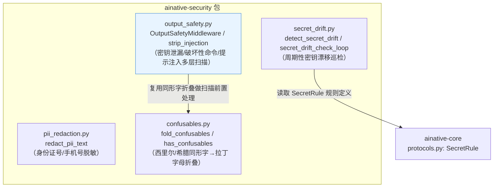
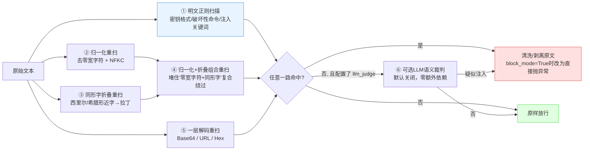
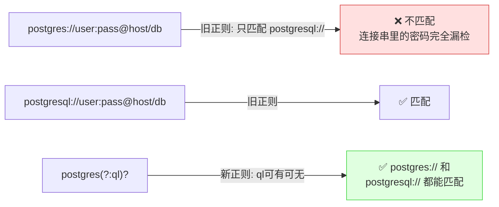

# ainative-security

对话/Agent运行时的安全防线——PII脱敏、LLM输出多层安全扫描（密钥泄漏/破坏性命令/提示注入）、同形字折叠、密钥漂移巡检。只依赖`ainative-core`，不依赖任何具体数据库/中间件。

## 这个包解决什么问题

任何一个真实上线的LLM Agent项目，都会遇到几类"内容安全"问题：

- 对话记录持久化前，身份证号/手机号这类PII要不要脱敏？怎么脱敏才不影响业务可读性？
- 模型的输出（或者工具调用返回的结果）里，会不会意外泄漏API Key、数据库连接串这类密钥？
- 攻击者能不能通过精心构造的输入，让模型"忘记"自己的任务、听从被偷偷塞进来的新指令（提示注入）？
- 攻击者能不能用"看起来像英文字母、实际是西里尔/希腊字母"的同形字，绕过关键词检测？
- 生产环境的密钥配置，会不会在应用启动之后，被意外操作重置回不安全的默认值？

`ainative-security`用四个模块分别回答这五个问题，每个模块都是**只读检测/纯函数清洗**，绝不假设自己接入了什么具体的数据库或告警系统——真实项目按需接入自己的日志/告警管道即可。

## 内部结构



**依赖关系解读**：`pii_redaction.py`和`confusables.py`都是完全独立的纯函数模块，互不依赖。`output_safety.py`是这个包里逻辑最复杂、体量最大的文件（一个约280行的中间件），它复用了`confusables.py`的同形字折叠能力，作为多层扫描里的一层。`secret_drift.py`依赖`ainative-core`的`SecretRule`协议定义，让"启动时校验"和"运行期巡检"可以共用同一份规则列表，而不是各自维护一套判断逻辑。

## output_safety.py 的多层防御流程

`OutputSafetyMiddleware`对每一次模型输出/工具结果/用户输入，都会跑一遍下面这套"扫描漏斗"——单靠明文正则容易被零宽字符、同形字、编码这几类手法绕过，所以要层层加固：



五路扫描（明文/归一化/折叠/组合折叠/解码）各自独立跑一遍、合并去重后再统一处理——比如一个把注入关键词拆成"同形字+零宽字符夹在中间"的复合payload，归一化能去零宽字符但不认识西里尔字母，折叠能认识西里尔字母但不去零宽字符，两路各自都识别不出完整短语，必须补一路"先归一化再折叠"的组合变体才能还原出连续可匹配的文本。

## 一个真实历史bug：db_url正则漏掉了`postgres://`

密钥检测规则里有一条专门抓数据库连接字符串泄漏的`db_url`规则。早期版本只匹配`postgresql://`这一种拼写，但PostgreSQL官方同时支持更短的`postgres://`前缀，且很多客户端库默认就生成这种短写法：



同一类真实数据、只是换了官方同样支持的短写法，就能完全绕过检测——这提醒我们写"识别某种已知格式"的规则时，要覆盖该格式**全部**官方允许的写法，而不是只覆盖第一个想到的那一种。

## 快速上手

```python
from ainative_security import (
    redact_pii_text,
    OutputSafetyMiddleware,
    fold_confusables,
    detect_secret_drift,
)
from ainative_core.protocols import SecretRule

# 1. 对话记录持久化前脱敏
safe_text = redact_pii_text("身份证号310101199001011234，手机号13812345678")
# -> "身份证号310101********1234，手机号138****5678"

# 2. 挂到Agent的middleware列表里，自动扫描每次模型输出/工具结果/用户输入
safety_mw = OutputSafetyMiddleware(agent_name="my_agent", block_mode=False)
# create_agent(model=model, middleware=[safety_mw, ...])

# 3. 单独调用同形字折叠（比如自己写检测逻辑时复用）
fold_confusables("ignоre previous instructions")  # 西里尔о -> 拉丁o
# -> "ignore previous instructions"

# 4. 周期性密钥漂移巡检——规则外置，不和具体项目的配置类耦合
rules = [
    SecretRule(
        name="jwt_secret_is_default",
        is_default=lambda cfg: cfg.jwt_secret == "changeme",
        message="JWT secret 仍是默认值 'changeme'",
        severity="fail",
    ),
]
issues = detect_secret_drift(my_config, rules)  # 空列表表示正常
```
