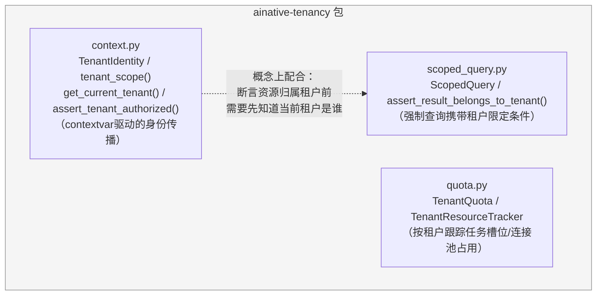
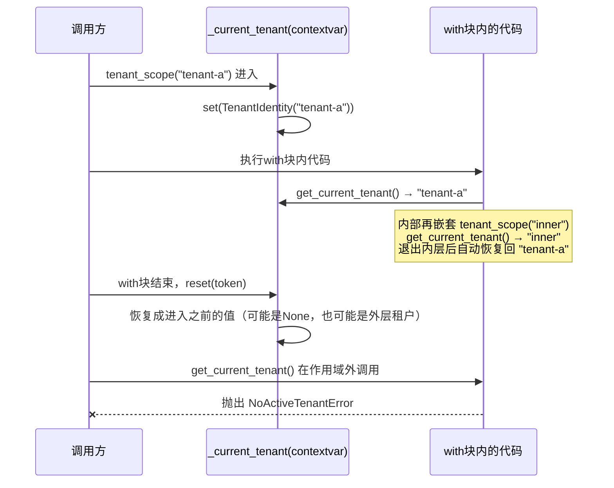

# ainative-tenancy

多租户身份传播、资源配额隔离、检索作用域断言——三道独立防线，分别堵住"数据隔离""资源/容量隔离""检索范围隔离"这三个必须分开评估的多租户安全维度。

## 这个包解决什么问题

一个多租户系统（多个客户/组织共用同一套代码和基础设施）真正出事故的地方，往往不是"完全没做隔离"，而是"隔离策略看起来是对的，但某个环节没有真正生效"：

- 租户身份要传播到很深的调用链里（ORM查询、缓存key生成……），如果每一层函数都要求手动传一个`tenant_id`参数，迟早会有一层忘记传、或者传错——`context.py`用`contextvars`让"当前是哪个租户"在整条调用链上自动可见，不依赖手动透传。
- 就算知道"当前是哪个租户"，如果底层真正共享的计算资源（任务队列、数据库连接池）不按租户分别计数，一个任务量大的租户依然可以挤占别人的资源——`quota.py`按租户粒度跟踪占用量，在真正开始占用之前就做配额检查。
- 就算查询代码写了"按租户过滤"，如果这个过滤条件是在查询之后才对结果做筛选（而不是从查询源头就限定），或者干脆有一种"不过滤"的模式被遗留在代码里，隔离就形同虚设——`scoped_query.py`把"必须带租户限定"做成构造函数层面的强制约束，没有任何合法的"不限定"取值。

这三个模块对应的都是真实事故复盘出来的失效模式，而不是抽象设计出来的功能清单。

## 内部结构



**依赖关系解读**：三个模块之间没有直接的代码import依赖，各自可以独立使用——`quota.py`的`TenantResourceTracker`完全不需要知道`context.py`的存在，`ScopedQuery`也可以在没有`tenant_scope()`的场景下单独构造使用（比如调用方从HTTP请求头里直接解析出`tenant_id`，而不经过`contextvars`）。`context.py`和`scoped_query.py`是"概念上配合"：典型用法是先用`get_current_tenant()`拿到当前租户身份，再用它构造`ScopedQuery`发起查询，返回结果后用`assert_result_belongs_to_tenant()`做最后一道复核。

**关于`ainative-core`依赖**：`pyproject.toml`声明了对`ainative-core`的依赖，但当前`ainative_tenancy`包内三个模块的实际代码都没有`import ainative_core`——这个依赖目前是"预留"状态，尚未被用到。

## `tenant_scope()`的作用域边界怎么工作



**一个容易踩的坑（不是bug，是`contextvars`本身的标准行为）**：如果在`tenant_scope("tenant-a")`内部用`asyncio.create_task()`派生一个后台任务，这个任务会拷贝一份**创建时刻**的租户身份快照；即使父作用域后续退出、把`_current_tenant`重置了，这个已经在运行的后台任务也不会感知到重置，会在自己整个生命周期里继续沿用创建时那个租户身份。所以生命周期可能超出父请求的后台任务，必须在任务体内部自己重新调用一次`tenant_scope(...)`，不能依赖"我是在某个作用域里被创建的，所以身份一定对"这种隐式假设——`tests/test_context.py`里的`test_background_task_created_inside_scope_keeps_tenant_after_parent_scope_exits`专门把这个行为写成了一条可执行的回归测试，而不是只停留在文档里。

## 快速上手

```python
from ainative_tenancy import (
    tenant_scope,
    get_current_tenant,
    assert_tenant_authorized,
    TenantResourceTracker,
    QuotaExceededError,
    ScopedQuery,
    assert_result_belongs_to_tenant,
)

# 1. 身份传播：进入某个租户的作用域后，深层调用都能拿到这个身份
with tenant_scope("tenant-42"):
    current = get_current_tenant()
    print(current.tenant_id)  # "tenant-42"

    # 读取资源前先断言归属租户一致，不一致直接抛异常
    assert_tenant_authorized("tenant-42")  # 通过，不抛异常

    # 2. 资源配额：按租户跟踪任务槽位占用，超配额时拒绝而不是排队
    tracker = TenantResourceTracker()
    tracker.register_quota("tenant-42", max_concurrent_jobs=5)
    tracker.acquire_job_slot("tenant-42")
    try:
        ...  # 执行真正的任务
    finally:
        tracker.release_job_slot("tenant-42")

    # 3. 检索作用域：强制查询携带租户限定条件，查询后再做一次复核
    query = ScopedQuery(tenant_id="tenant-42", extra_filters={"doc_type": "invoice"})
    filter_dict = query.build_filter()  # {"doc_type": "invoice", "tenant_id": "tenant-42"}
    # 把 filter_dict 真正传给存储层的查询接口（示例，非真实存储调用）：
    # results = my_store.search(filters=filter_dict)
    for result_tenant_id in ["tenant-42"]:  # 假设这是查询返回结果里每条记录的租户字段
        assert_result_belongs_to_tenant(result_tenant_id, query)  # 复核不通过会抛异常

try:
    tracker.acquire_job_slot("some-unregistered-tenant-with-no-quota-left")
except QuotaExceededError as exc:
    print(f"拒绝：{exc}")
```
