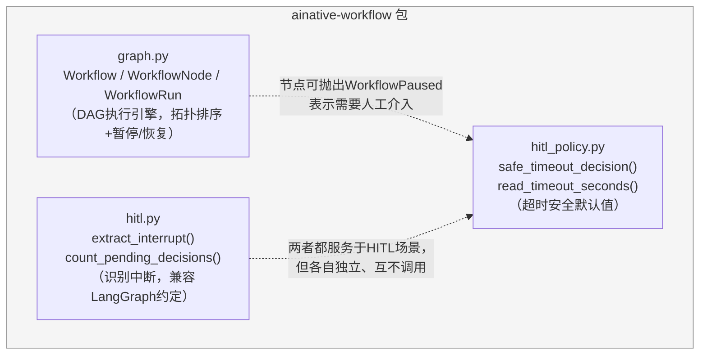
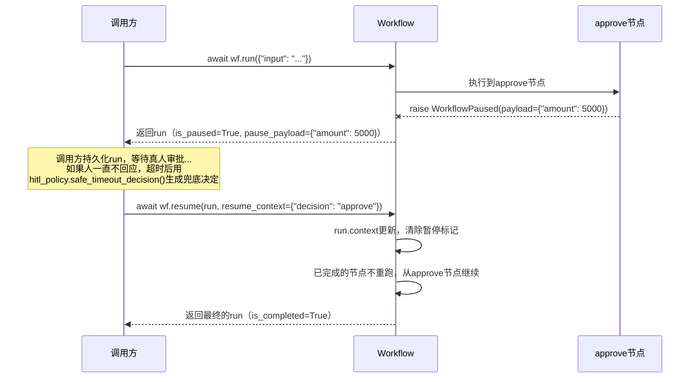

# ainative-workflow

轻量DAG工作流编排引擎、HITL（Human-in-the-loop）中断检测、超时安全默认值——不依赖`ainative-core`以外的任何框架内部包，也不引入Postgres/Redis等外部基础设施。

## 这个包解决什么问题

当一个任务需要拆成"多个有先后依赖关系的阶段"来执行时，会遇到三个具体问题：

- 阶段之间怎么声明"谁必须在谁之后执行"，又怎么按正确顺序真正跑起来？某个阶段的输入不满足时（比如上一步被跳过了）该怎么处理？
- 某个阶段执行到一半，需要暂停下来等人工审批，该怎么"干净地"暂停，又怎么在人工做出决定后，从暂停的地方继续，而不是从头重跑？
- 人如果一直不回应（超时）该怎么办——默认行为绝对不能是"当作批准放行"，这是一条不能靠约定、只能靠代码结构保证的安全底线。

`ainative-workflow` 用三个模块分别回答：`graph.py`（DAG执行引擎，拓扑排序+条件跳过+暂停/恢复）、`hitl.py`（从执行结果里识别"这是被中断了，不是跑完了"）、`hitl_policy.py`（超时后的安全默认决定）。

## 内部结构



**依赖关系解读**：三个模块彼此之间没有代码层面的import依赖——`graph.py`的`WorkflowPaused`异常和`hitl_policy.py`的安全超时决定是"概念上配合使用"（一个节点暂停后，调用方通常会设置一个超时，超时后用`hitl_policy.safe_timeout_decision()`生成默认决定去`resume()`这次运行），但代码层面完全解耦，`graph.py`不知道`hitl_policy.py`的存在，反之亦然。`hitl.py`则是为了兼容LangGraph这类外部编排框架的"中断标记"约定而存在的独立工具，不要求调用方一定使用本包的`Workflow`引擎。

## 暂停与恢复是怎么工作的



## 这次加固中修复的真实bug

**`Workflow.run`/`resume`的别名污染bug**：原本用`dict(initial_context)`（浅拷贝）存入`WorkflowRun.context`——如果调用方传入的字典里某个value本身是嵌套dict/list，节点执行过程中修改这个嵌套结构会直接改到调用方自己手上那份"模板"上，导致同一个context对象被复用去发起多次运行时，前一次运行的节点执行结果会意外污染后一次运行的初始状态。现在`run()`/`resume()`都改为`copy.deepcopy(...)`，与本框架中`merge_mcp_configs`、`InMemoryAgentRegistry`、`InMemoryMemoryStore`修复的是同一类问题。

## 快速上手

```python
from ainative_workflow import Workflow, WorkflowNode, WorkflowPaused

def fetch_data(ctx: dict) -> dict:
    return {"amount": 5000}

def validate(ctx: dict) -> bool:
    return ctx["raw"]["amount"] < 10000

def request_approval(ctx: dict) -> str:
    if not ctx["is_valid"]:
        raise WorkflowPaused(payload={"reason": "amount exceeds auto-approve threshold"})
    return "auto-approved"

wf = Workflow([
    WorkflowNode(name="fetch", fn=fetch_data, output_key="raw"),
    WorkflowNode(name="validate", fn=validate, depends_on=("fetch",), output_key="is_valid"),
    WorkflowNode(name="approve", fn=request_approval, depends_on=("validate",), output_key="decision"),
])

run = await wf.run({})
if run.is_paused:
    # 持久化run，等待人工审批...
    run = await wf.resume(run, resume_context={"decision": "manually approved"})

print(run.is_completed, run.context)
```
